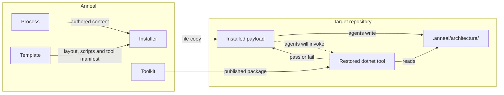

[← Project README](../../README.md)

# Overview

Anneal delivers a process, and increasingly executes on it. Most of the payload is prose an AI coding
agent reads, together with a template describing the repository that prose expects, a script that
enforces the single rule the process refuses to leave to judgement, and an installer that puts all
three into somebody else's repository. Alongside them Toolkit runs — a .NET tool hosting operations
the agents will call, executing deterministic checks and controlling the conversations behind model-backed
judgement. That mix is the organizing idea the inventory below rests on. Three systems deliver the
content, and the fourth executes on it rather than describing it — the one mechanical enforcement now
runs as one of the executing system's operations rather than as a system of its own, and the
interesting design pressure is that even the executing system composes context for judgement to
happen against rather than encoding the judgement itself.

The consequence runs through every decision recorded here. Instructions cannot be executed to see whether
they work, so verification splits in two: properties of the files themselves are checked by script, and
properties of what agents do are established by inspection or by a sandbox run against a
throw-away repository. The split is load-bearing here because the majority of what Anneal ships is
instructions rather than behavior — the Toolkit is executed, but what it executes is context assembly
for a model rather than encoded judgement.

## Systems

- [Process](./process.md) — the agents, standards and skills that instruct an AI coding agent; a
  bootstrap harness with a scheduled end, being dismantled into Toolkit operations
- [Installer](./installer.md) — delivery of the payload into a target repository
- [Template](./template.md) — the canonical repository layout a product repository receives
- [Toolkit](./toolkit.md) — the executed operations, deterministic and model-backed, that agents will call

## Interactions

The systems couple weakly and in one direction: Process defines content, Template defines where content
sits, Installer moves both, and Toolkit audits the arrived result through its enforcement operation while
its other operations wait for the content to call them.

Every edge is a **file**, never a call — with one exception. Installer copies; the deterministic checks
read markdown and test results from disk; agents read their own prompts when invoked. No system imports
another. The exception is Toolkit: it arrives as a restored package rather than a copied file, runs as
a process, and its model-backed operations reach the network. That exception is the whole substance of
the superseded *Files, not tooling* decision below, and it is confined to one system so that everything
else keeps the property — a system can still be replaced wholesale without recompiling anything.

That exception is widening for the duration of the migration. Prose agents invoke `dotnet anneal`
directly, so a call becomes the normal edge from Process to Toolkit rather than an anomaly, and
[MIGRATION.md](../../MIGRATION.md) carries it in the suspension register. It is not restored at the
end: Process is dissolved, and the rule will have nothing left to describe.

The one cycle in the diagram is deliberate. The Toolkit audits a tree that agents from the payload
wrote, so the payload is both the author of the evidence and the subject of the audit. That is tolerable
only because the check is mechanical and fails closed — an agent cannot talk it into passing.

## Boundaries

Every system but Toolkit is files on disk acted on by short-lived PowerShell invocations, with no
process, deployment or concurrency boundary between them. Toolkit introduces the repository's only
deployment boundary — it is versioned and published independently of the payload, so an installed
repository may run a Toolkit older or newer than the agents that will call it — and its only network
boundary, since a model-backed operation leaves the machine.

Two trust boundaries matter. `install.ps1` writes into a **different repository** than the one it runs
from, and it is the only component that does. Everything it writes is content the target repository will
subsequently trust and act on, so the constraints protecting that write — that installation goes through
a provided script, and that nothing is deleted without confirmation — are recorded in
[.anneal/work/constraints.md](../work/constraints.md) rather than left to the installer's own documentation.

The second is Toolkit's model boundary. Repository content is sent to a model under the ambient Copilot
account of the calling session, which is the account the agents already run under, so the boundary moves
no data to a party that was not already receiving it. The tools granted to a model are read-only and
explicitly enumerated, because the surrounding SDK exposes mutating built-ins when a tool allowlist is
left absent; that is `TOOLKIT-I1` rather than a note here.

## Repository-Wide Decisions

**What must not be reintroduced** — Anneal exists because the predecessor process made design change
expensive. The cost came from four specific mechanisms: per-unit artifact fan-out (five artifacts per
software item, down to individual classes), per-unit requirements (a requirements file per subsystem and
unit, with identifier churn on every move), hard-fail companion gates (missing artifacts failed the
build, turning every omission into a full retry), and multi-retry orchestration (PLANNING → DEVELOPMENT
→ QUALITY with three retries, multiplying everything). Each was removed because its cost is paid on
every subsequent change, and that cost — not the shape — is the admission test a new mechanism has to
fail. Reproducing one of those cost patterns is a redesign, not an incremental regression. Automation
that mechanizes work to remove per-change cost is the direction Anneal is moving in and is not
caught by this rule; [vision.md](../governance/vision.md) states what does and does not qualify.

**Files, not tooling — superseded by Toolkit** — Anneal originally installed by file copy alone: no build
step, no package manager, no runtime dependency in the target repository. The decision named its own
reconsideration trigger — *"if Anneal ever needed to ship executable content that a copy cannot carry"* —
and that trigger fired. Presenting a response schema at the end of a conversation rather than the start
measurably improves reliability, and no arrangement of prompt files can express it, because a prompt
cannot control where in a context window an instruction lands. What overturned the decision is therefore
a capability that copying cannot provide at any effort, not a convenience.

What survives is the reasoning, narrowed: the **payload** still installs by file copy, so renaming an
agent still needs no script change, and a repository that never invokes an operation still needs nothing
but the copy. Only Toolkit is acquired as a package, and adoption stays unconditional on an ecosystem
for everything else. The cost accepted is that Anneal now has a build, a published artifact and a
version to keep straight, in a repository whose product was previously only prose.

**One mechanical rule, everything else judgement — now one rule plus declared gates** — the clause-to-test
link remains the only rule enforced across every change. Toolkit adds gating that is opt-in per
operation rather than universal: an operation declares itself as enforcement, research, advisory or
authoring, and only enforcement can fail a build. Blanket enforcement is still rejected for the original
reason — a blocking gate on every file change is precisely the cost this process exists to avoid — and
so is any gate that cannot fail closed. The category is what makes the addition safe: a research or
advisory operation cannot become a gate by accident, because gating is a property of the declaration
rather than of the exit code.

**Verification splits by what is being verified** — structural properties of the payload are checked by
script, and behavioral properties of agents are established by inspection or a sandbox run. Requiring
everything to be script-checkable was rejected because it would silently narrow the contract to whatever
is cheap to test; requiring everything to be agent-verified was rejected because it makes every commit
expensive. The split is recorded here rather than in Process because it constrains how every system in
this repository may write a clause.

**The repository is laid out as an installed repository** — Anneal maintains itself with its own agents,
so most root files exist twice, once working and once pristine under `.github/template/`. The alternative,
a separate example repository, was rejected because it would be exercised only when someone remembered to
exercise it. The cost is real and is bounded by a constraint: the template must stay valid for a C#
product repository regardless of Anneal's own needs.

**Doc comments replace unit-level requirements, design, and verification** — interior intent is recorded
in doc comments because a doc comment is the only place that costs nothing to keep in sync: it is
colocated, so a refactor edits it in the same file, and deleting the code deletes it. The same reasoning
that embeds contracts in `{system}.md` rather than a parallel tree, applied one level down. Rejected on
one side: recording interior intent in separate artifacts — the fan-out this process exists to remove.
Rejected on the other: mandating a doc comment on every symbol regardless of whether it carries intent.
Blanket coverage produces signature restatement at scale, and because nothing verifies a doc comment,
filler propagates and compounds. So the boundary is mandatory and compiler-enforced, and interior members
are documented by reason: intent that cannot be recovered from the code, or nothing.

**`docs/user-guide/` is deliberately outside the tree's `covers` lists** — `technical-documentation.md`
§ User Guides decouples user documentation from structure so that user-facing prose does not churn when
internals move. The obligation to update the guide is triggered by a change to the surfaces it documents
(`install.ps1`'s interface, `helper`'s behavior, `architecture-design`'s purpose), not by any interior
change to the payload.
