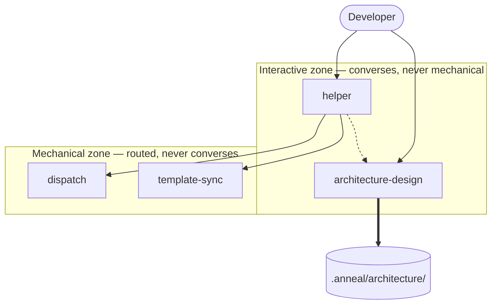

[← Architecture Overview](./overview.md)

# Process

Process is the bootstrap harness: the agent prompts, the standards, and the skills they load
on demand. Its content is read by a language model rather than executed, and everything odd about
this repository follows from that. It is **terminal** — [active-plan.md](../work/active-plan.md)
dismantles it into compiled processes, with `helper` and `architecture-design` absorbed last — so
the contract below is deliberately not extended, and a clause is retired with the agent it describes
rather than carried forward. If Process were rewritten, a consumer would notice immediately — not
because an interface changed, but because agents would classify work differently, touch different files,
and stop at different boundaries. The observable surface of a prompt is the behavior it produces.

That makes the contract below unusual, and it is worth being explicit about what it does **not** cover.
No clause here promises that an agent behaves well — the repository-wide decision in
[overview.md](./overview.md) records the verification split and why it exists. What the contract covers
is the structural integrity of the payload: the properties that must hold for the prose to be loadable,
routable, and internally consistent at all. A prompt that fails these is broken regardless of how well it
is written.

## Contract

### Provides

- **PROCESS-01** — Every agent file carries front matter whose `name` matches its filename and whose
  invocation flags are well-formed, so an agent can be selected by name without reading its body.
  *Verified by:* `AgentFrontMatterIsWellFormed`

- **PROCESS-02** — Every standard, skill, and agent prompt named by an agent prompt exists at the path
  given, and every other path an agent prompt names belongs to the repository layout this process
  defines — the layout [Template](./template.md) ships, and the files and directories every installed
  repository carries — so no reference resolves only in the repository the payload was authored in.
  What is promised is membership in that layout, not presence on disk: `.anneal/work/active-plan.md`
  belongs to the
  layout while being absent from every repository outside a Migration. Build output the tooling
  produces rather than the layout defines is outside this promise.
  *Verified by:* `AgentReferencesResolve`

- **PROCESS-03** — Every standard in `.github/standards/` is reachable by an agent — named by an agent
  prompt, or by the Standards Application matrix in `AGENTS.md` that every agent loads — so no standard
  ships that nothing loads.
  *Verified by:* `NoOrphanedStandards`

- **PROCESS-04** — Every agent prompt defines a report template whose first metadata field is `**Result**`.
  *Verified by:* `ReportTemplateShapeIsUniform`

- **PROCESS-05** — Every agent handles each result value that any agent it invokes is able to emit.
  *Verified by:* `HandoffCoverageIsComplete`

- **PROCESS-06** — The worst-case single invocation — `AGENTS.md`, the largest agent prompt, and the four
  largest standards — stays within the context budget declared in
  [Prompt Authoring](./process/prompt-authoring.md), counted by the method declared there.
  *Verified by:* `WorstCaseInvocationWithinBudget`

- **PROCESS-07** — Every work mode the payload names — in a report template's mode field, in the
  classification vocabulary `AGENTS.md` carries, or in the phrase form `{Name} mode` — is one that
  `change-classification.md` defines, so no agent can act on a classification no other agent recognizes.
  *Verified by:* `ModeVocabularyIsClosed`

- **PROCESS-08** — The repository's `AGENTS.md` equals `.github/template/AGENTS.pristine.md` plus its
  Template Stewardship section, so process content cannot drift between the working and shipped copies.
  *Verified by:* `AgentsFileMatchesPristine`

- **PROCESS-09** — Every Scope value the payload's report-template fields name is one that
  `change-classification.md` defines, so the vocabulary agents route on cannot be extended or
  re-labelled by a single file.
  *Verified by:* `ScopeVocabularyIsClosed`

- **PROCESS-10** — Every Effort value the payload names is one that `change-classification.md`
  defines, so the magnitude vocabulary a decomposition check routes on cannot be extended or
  re-labelled by a single file — the same closure PROCESS-09 already gives Scope, extended to the
  axis alongside it.
  *Verified by:* `EffortVocabularyIsClosed`

### Requires

- **[ContractCheck](./toolkit/contract-check.md)** — mechanical verification of clause-to-test links, and a
  failure taxonomy stable enough for a skill to explain.
- **[Template](./template.md)** — presence of an unmodified `AGENTS.pristine.md` in the shipped layout,
  and of the repository scripts the agent prompts instruct an agent to run together with the tooling
  configuration those scripts read.

### Invariants

- **PROCESS-I1** — Exactly two agents are user-invocable; every other agent is reachable only as a
  sub-agent.
  *Verified by:* `EntryPointsAreExactlyTwo`

- **PROCESS-I2** — No normative rule is stated in more than one payload file; other files reference the
  owning file rather than restating it.
  *Verified by:* `NormativeRulesHaveOneOwner`

## Composition

Process divides into two zones with a single crossing point, and the division is the most important thing
about its interior.

Three kinds of edge appear, and confusing them is the failure this diagram exists to prevent:

- **Solid — invocation.** One agent calls another as a sub-agent and consumes its report.
- **Thick — artifact.** No call occurs. `architecture-design` writes the tree, and other agents read it
  later, possibly in a different session.
- **Dotted — hand-off by name.** `helper` tells the developer to invoke `architecture-design` themselves.
  It must not call it, because that agent's method is a live interview and a headless invocation would
  invent the answers.

`scope-check.agent.md` is gone from this diagram entirely — retired at Migration stage S18, following
the `lint-fix`/`apply`/`architecture-update` precedent below — rather than kept as a Mechanical-zone
node with nothing left calling it.

The zones exist because the two kinds of agent fail differently. An interactive agent fails by assuming
instead of asking; a mechanical one fails by widening its scope or misreporting its result. The
mechanical zone is therefore where the structural contract above earns its place, and the interactive
zone is where behavioral verification is spent.

For the span of the migration [active-plan.md](../work/active-plan.md) carries, a third shape coexists with
these two rather than replacing either: a compiled Router selects one of a small worker catalog
(`DemaConsulting.Anneal.Toolkit.Process`), each worker composed from the primitive library
[Toolkit](./toolkit.md) owns. `dispatch` calls it directly for Change mode via `route`, for Maintenance
mode via `maintain`, and for a declared stage-ahead-of-implementation request via `stage-contract` (see
Decisions below); verifying a diff that never went through any of the three at all — a hand-written
change, an externally contributed one, or anything predating this migration — is `verify-change`, a
compiled action a developer or `helper` runs directly, never a sub-agent, since it reports and edits
nothing, the same relationship `lint-fix` already has to this diagram without appearing in it as an
agent. See Decisions below.

The **standards** are cross-cutting rather than owned by any agent: each is the single definition of its
subject, and agents load two to four by task. This is why PROCESS-02 and PROCESS-03 are contract clauses —
a payload whose references do not resolve is not a smaller payload, it is a broken one. The **skills** sit
below the standards and carry repeatable procedures that would otherwise bloat a prompt paid for on every
invocation.

The standards divide into two populations, and PROCESS-03 admits two loading surfaces because of it. The
**process** standards — architecture documentation, change classification, system contracts — are named
directly by the agent prompts, because every agent here does process work and knows at authoring time
which of them it needs. The **product-code** standards — coding, C# language, C# testing, technical
documentation, testing principles — are named by no prompt at all, and reached only through the Standards
Application matrix keyed on the file types an agent discovers at runtime. That indirection is deliberate:
requiring each prompt to name them would hard-code a product technology into agents that must stay
technology-neutral, and would enlarge every prompt against the budget PROCESS-06 defends.

The seam that must not move is the one between `helper` and `dispatch`. Everything upstream of it talks
to a person; everything downstream is classified, bounded work. If that seam ever widens — if `helper`
starts performing work, or a mechanical agent starts asking the developer questions — the interactive
zone has become a system in its own right and should be split out of Process.

## Decisions

**`architecture-design` is deliberately not model-invocable** — it is marked
`disable-model-invocation: true` so no agent can call it. The rejected alternative was letting `dispatch`
invoke it when boundaries look wrong, which would produce a plausible architecture tree that nobody
agreed to. That is worse than producing none, because a tree carries authority once it exists. This
reverses only if the agent gains a non-interview mode whose output is explicitly provisional.

**`helper` routes but never works** — the front door classifies nothing and edits nothing; it gathers
context and calls `dispatch`. Allowing it to make small edits directly was rejected because a self-granted
exemption does not stay narrow, and because `helper` does not load the standards that would make the edit
correct. The same argument is under review one level down for `dispatch`, and is recorded in
[.anneal/work/backlog.md](../work/backlog.md).

**Exactly two entry points** — every other agent is a sub-agent, so there are no trigger words to learn.
The rejected alternative was exposing each agent to the developer, which pushes classification onto the
person least equipped to do it consistently.

**Standards are loaded on demand, never bundled** — recorded here because it is the design choice the
budget PROCESS-06 protects depends on. [Prompt Authoring](./process/prompt-authoring.md) owns the
mechanism and why bundling into `AGENTS.md` was rejected.

**Bounded repairs, no planning phase** — `dispatch` allows one documentation repair and one code repair
per change, because a documentation finding has to be fixed before implementation can use it, but
grinding a finding that will not clear means the change was misunderstood at the start. The rejected
alternative was a PLANNING → DEVELOPMENT → QUALITY state machine with three retries, which multiplied
every cost by up to four and made the process expensive rather than the design. What was refused was
the multiplier — cost paid on every subsequent change — not orchestration itself; sequencing bounded
work is what `dispatch` already is.

**The classification vocabulary is contracted as two clauses, not one** — modes and scope are one idea
to a reader and two different problems to a checker, and PROCESS-07 spent a release as an unfulfilled
obligation because of it. The mode half is only checkable while no payload file uses the word for
something else: `template-sync` called its own three operations modes, and its report field declared
them in a form indistinguishable from a work-mode declaration, so any pattern strict enough to catch a
real mistake also caught that file. Renaming that agent's concept to **Operation** — rather than
renaming the work modes, which a standard owns, five agents reference, and PROCESS-07 rides on — is
what made the mode half honestly mechanizable, and the two halves then earn separate clauses because
each is checked by a different reading of the payload and either could lose its mechanism without
taking the other with it. The rejected alternative was one clause naming two tests, which would report
a single verdict over two independent promises and hide which one had lapsed.

**Every mode here is bound by the constraint-admission rule, not only Intake** — no entry in
`.anneal/work/constraints.md` has ever arrived through Intake in this repository's history, so closing only the
Intake path would have left every other mode's route into the file open. This entry records that
Process's Decisions section holds Change, Maintenance and Migration to the rule exactly as Intake is
held; `change-classification.md` § *Only the User Admits a Constraint* owns the rule itself, the
reasoning behind it, and the proposal mechanism.

No clause is added for it. Whether an agent proposes rather than files is a property of what agents do,
not of whether the payload loads and routes, so it falls on the behavioral side of the verification split
in [overview.md](./overview.md) and is established by inspection. Mechanizing it would mean deciding from
text alone whether a mention of `.anneal/work/constraints.md` authorizes a write or merely points at it —
a judgement the four files that legitimately name the register would defeat.

**Scope values are bare names, not qualified ordinals** — S10 retired the numeric ordinal scale in
favor of naming each value directly after the toolkit's own compiled worker
(`SmallFixWorker`, `ContractChangeWorker`, `StructuralChangeWorker`), so the vocabulary humans read and
the vocabulary the code already runs became the same words. The ordinal-plus-qualifier apparatus this
entry used to describe existed only to keep a bare numeric scale readable and correctly ordered — a
name alone carries no direction, and the priors a model brings about a bare `0`, `1`, `2` scale point
the wrong way in this domain, where its lowest ordinal was the trivial class rather than the severe
one incident and security usage would suggest. Once the scope vocabulary is itself a set of names with
no numeral to misread, that scaffolding is redundant weight rather than a safeguard: **Scope may still
be raised mid-flight, never silently lowered** — `change-classification.md` states the order the three
names carry — but nothing about that ordering depends on a digit or a parenthetical qualifier being
repeated at each decision site.

**`lint-fix` left the diagram entirely rather than changing shape within it** — the compiled
`dotnet anneal lint-fix` (`TOOLKIT-19` in [Toolkit](./toolkit.md)) was proven end to end against this
repository at Migration stage S6, the condition [active-plan.md](../work/active-plan.md) had named for
retiring the prose agent that preceded it, so `.github/agents/lint-fix.agent.md` is retired rather
than kept as a fallback with nothing left to fall back from. The node is removed rather than
redrawn as something else in the Mechanical zone, because it was never a sub-agent another agent
calls and consumes a report from — a developer or `helper` invokes `dotnet anneal lint-fix` directly,
the same relationship `ContractCheck` already has to this diagram without ever appearing in it as an
agent. Redrawing it as a direct-invocation node was rejected: this diagram's solid edges are
reserved for sub-agent invocation with a consumed report, and a fourth edge kind for "developer runs
a compiled command" would document machinery this system does not decide, since Toolkit already owns
that boundary in [overview.md](./overview.md) and `toolkit/lint-fix.md`.

**`dispatch`'s edges to `architecture-update`, `apply`, and `scope-check` were removed, not redrawn** —
at Migration stage S11, `dispatch` began calling `route` directly for every Change-mode request instead
of chaining `architecture-update` → `apply` → `scope-check`; at S15, its Maintenance-mode edge moved to
`maintain` the same way. At the time, `architecture-update` kept its edge to `Tree` and `scope-check`
kept its edge from `Helper`, because each still did a job neither `route` nor `maintain` covered:
`architecture-update` wrote a contract clause *ahead of* implementation, as a deliberate planned
obligation — `route`'s Contract Change and Structural Change workers always compose document authoring,
code authoring, and verification together in one atomic pass, with no "write the promise, implement it
later" mode. `scope-check` verifies a diff that never went through `route` or `maintain` at all — a
hand-written change, an externally contributed one, or anything predating this migration — where
`route`'s own verification step only ever judges what its own pass just authored.

**`apply.agent.md` was retired at Migration stage S16**, once its last two callers — `helper`'s "a
specific fix already reported" row and `dispatch`'s own stale Migration-mode line — were rewired to
`dispatch` itself, following exactly the `lint-fix` precedent above: the node is removed once nothing
calls it, not kept as an unused fallback. Its own removal from the diagram left `architecture-update`
and `scope-check` each with one fewer edge, adjusted above; neither agent's own remaining job changed.
`architecture-update` and `scope-check` were not exempt from the same fate — each was the next named
target once a compiled equivalent for its remaining job existed (a design-only path built from
`DocumentAuthor` alone, and a standalone verify path built from `Verifier` and the existing
`DeterministicCheck` pair), not a permanent carve-out from the destination this file states.

**`architecture-update.agent.md` was retired at Migration stage S17**, once `stage-contract` — the
Toolkit's compiled design-only path, running `DocumentAuthor` alone to stage a contract clause ahead
of implementation — was live-validated against a real model, the same bar `maintain` cleared before
`apply.agent.md` retired. `dispatch` gained a **caller-declared** branch for it: Step 1 sends a request
to `stage-contract` only when the user explicitly asked to stage a clause rather than build it now,
never inferred from a request's size or difficulty, mirroring how Maintenance mode is caller-declared
rather than classified. `helper` gained one Step 3 table row routing the same ask to `dispatch`, since
`helper` never implements and staging a clause is `DocumentAuthor` performing exactly a documentation
edit. `architecture-update`'s edge to `Tree` is removed from the diagram above, following the
`lint-fix`/`apply` precedent: the node is removed once nothing calls it. One thing did not carry
forward — `architecture-update.agent.md`'s Step 5 produced an explicit `Prune Results` table naming
every section document examined and its verdict; `StageContractReport` carries only the files changed
and a summary, since the mechanical checks this stage added verify scope and clause well-formation, not
which documents `DocumentAuthor` considered pruning. `.anneal/architecture/toolkit/stage-contract.md`'s
own charter still instructs pruning; only the itemized report of it did not survive.

`scope-check` is not exempt from the same fate — it is the one remaining named target once a compiled
equivalent for its job exists (a standalone verify path built from `Verifier` and the existing
`DeterministicCheck` pair), not a permanent carve-out from the destination this file states.

**`scope-check.agent.md` was retired at Migration stage S18**, once `verify-change` — the compiled
standalone verify path built from `DiffCheck`, `DeterministicCheck`, and `Verifier`, the same
primitives `ContractChangeWorker`/`StructuralChangeWorker` already compose for their own verification
half — was live-validated against a real model, the same bar `stage-contract` cleared before
`architecture-update.agent.md` retired. Unlike `stage-contract`, `helper` invokes it directly rather
than routing through `dispatch`: `verify-change` declares `OperationCategory.Advisory`, edits nothing,
and produces no change for `dispatch` to classify or register, so there is nothing here for `dispatch`'s
per-change tracking to do — the same "developer runs a compiled command" relationship `lint-fix` already
has to this diagram, not the `stage-contract` precedent's sub-agent call. `helper`'s Step 3 table gained
one row for it; `AGENTS.md` and its pristine template counterpart gained the matching bullet.
`scope-check`'s own edge from `Helper` is removed from the diagram above, following the
`lint-fix`/`apply`/`architecture-update` precedent: the node is removed once nothing calls it. This was
the last named retirement target this file tracked; no further prose agent is queued behind it as of
this stage.

**The compiled catalog is a Router choosing a bounded worker, not a generic plan-build-review loop**
— the router asks one narrow typed question per pass (select a worker, ask for bounded research, or
report no route) against two independent counters, a research budget and a worker-reroute budget,
because the two are different failures: research means the router lacked facts, reroute means the
selected worker learned mid-execution that the classification was wrong, and sharing one counter
would let a cheap research pass starve a legitimate reroute. Cap exhaustion with no crisp human-only
next step reports `Failed`; it reports `Escalated` only when the router can name a specific step only
a person can take. The rejected alternative, considered directly against a comparable
planner-developer-quality implementation agent elsewhere, was a universal three-phase loop with fixed
retries on every change — rejected for the same reason **Bounded repairs, no planning phase** above
already rejected it once: the multiplier is paid on every subsequent change regardless of whether the
change needed it. Planner and Verifier are **route-selected per worker**, not universal — a Small Fix
worker (`Developer` → `DeterministicCheck`, one local repair pass) pays for neither, while a Structural
Change worker spends at most two `Planner` calls: an initial plan, and — only against a
`VerificationVerdict.StrategyRevisionRequired` finding, never a documentation or code repair finding —
one re-plan from its own independent, non-resetting budget, counted and exhausted separately from the
documentation and code repair budgets. Only Template Sync now remains deferred; Small Fix, Contract
Change, and Structural Change all ship. (An earlier draft of this entry claimed no prose agent could
retire until Template Sync existed too, citing the one-way invariant as authority — the invariant says
nothing about sequencing unrelated work, and later migration stages retired individual prose agents
as their own proven conditions were met. Corrected here rather than left standing as an unchecked
decree.)

**Effort joins Scope as a second classification axis, and Migration is preserved rather than
dissolved into it** — `change-classification.md` now classifies Change-mode work along Scope
(contract reach) and Effort (magnitude) independently, because neither implies the other: a
mechanical rename touching hundreds of files crosses no contract, and a one-line change to a public
signature crosses one. A Massive Effort item decomposes into phases only under a mandatory
cumulative-Scope check evaluated across the whole phase set — never phase by phase alone — plus a
deterministic tripwire on `.anneal/governance/`, `.anneal/profile/`, `.anneal/work/`, and
`.anneal/architecture/`, because a set of individually-innocent phases can still cross a boundary none
of them crosses alone.
Dissolving Migration into ordinary Scope×Effort routing was considered and rejected: Migration's step
invariants (self-hosting, one-way, no-silent-loss, named suspensions) are cross-phase monotonicity
properties that a per-request classification cannot express, and folding it away would mechanically
break `PROCESS-07`'s closed mode vocabulary. Migration is kept exactly as it already exists; the only
new integration point is that a single stage's own implementation, once a human has written the stage
and its exit condition, classifies by Scope and Effort like any other Change-mode work.

## Details

- [Prompt Authoring](./process/prompt-authoring.md) — how a prompt earns the tokens it costs, and
  what every prompt and standard in the payload must do to participate
