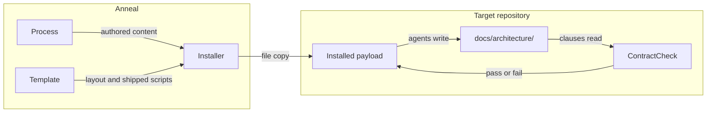

[← Project README](../../README.md)

# Overview

Anneal ships a process rather than running one. Nothing here executes against a product: the payload is
prose an AI coding agent reads, a template describing the repository that prose expects, a script that
enforces the single rule the process refuses to leave to judgement, and an installer that puts all three
into somebody else's repository. That is the organizing idea the inventory below rests on — three of the
four systems exist to deliver and defend the first, and the interesting design pressure is that the thing
being delivered is instructions rather than behavior.

The consequence runs through every decision recorded here. Instructions cannot be executed to see whether
they work, so verification splits in two: properties of the files themselves are checked by script, and
properties of what agents actually do are established by inspection or by a sandbox run against a
throw-away repository. Anneal is the only repository where that split is load-bearing, because it is the
only one whose product is a prompt.

## Systems

- [Process](./process.md) — the agents, standards and skills that instruct an AI coding agent
- [ContractCheck](./contract-check.md) — the one mechanical enforcement, and its failure taxonomy
- [Installer](./installer.md) — delivery of the payload into a target repository
- [Template](./template.md) — the canonical repository layout a product repository receives

## Interactions

The systems couple weakly and in one direction: Process defines content, Template defines where content
sits, Installer moves both, and ContractCheck audits the result once it has arrived.

Every edge is a **file**, never a call. Installer copies; ContractCheck reads markdown and test results
from disk; agents read their own prompts when invoked. No system imports another, and nothing runs in a
shared process, which is why a system can be replaced wholesale without recompiling anything.

The one cycle in the diagram is deliberate. ContractCheck audits a tree that agents from the payload
wrote, so the payload is both the author of the evidence and the subject of the audit. That is tolerable
only because the check is mechanical and fails closed — an agent cannot talk it into passing.

## Boundaries

There are no process, deployment or concurrency boundaries: every system is files on disk, and every
script is a short-lived PowerShell invocation.

One trust boundary matters. `install.ps1` writes into a **different repository** than the one it runs
from, and it is the only component that does. Everything it writes is content the target repository will
subsequently trust and act on, so the constraints protecting that write — copy-only installation,
collision detection before any write, and confirmation before deleting anything — are recorded in
[CONSTRAINTS.md](../../CONSTRAINTS.md) rather than left to the installer's own documentation.

## Repository-Wide Decisions

**Files, not tooling** — Anneal installs by file copy alone: no build step, no package manager, and no
runtime dependency added to the target repository. The rejected alternative was distribution as a package
with a version-resolved dependency, which buys upgrade mechanics at the cost of making adoption
conditional on an ecosystem. This would be reconsidered if Anneal ever needed to ship executable content
that a copy cannot carry.

**One mechanical rule, everything else judgement** — only the clause-to-test link is enforced by script;
every other rule in the process is held by prompt and review. More enforcement was rejected because a
blocking gate on every file change is precisely the cost this process exists to avoid, and because a check
that cannot be made to fail closed is worse than no check at all.

**Verification splits by what is being verified** — structural properties of the payload are checked by
script, and behavioral properties of agents are established by inspection or a sandbox run. Requiring
everything to be script-checkable was rejected because it would silently narrow the contract to whatever
is cheap to test; requiring everything to be agent-verified was rejected because it makes every commit
expensive. The split is recorded here rather than in Process because it constrains how every system in
this repository may write a clause.

**The repository is laid out as an installed repository** — Anneal maintains itself with its own agents,
so most root files exist twice, once working and once pristine under `.github/template/`. The alternative,
a separate example repository, was rejected because it would be exercised only when someone remembered to
exercise it. The cost is real and is bounded by a constraint: the template must stay valid for a C#
product repository regardless of Anneal's own needs.
