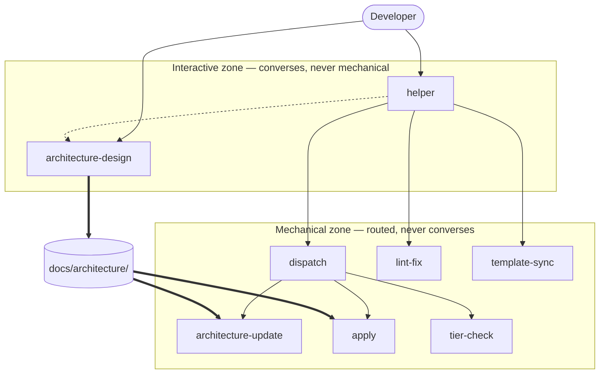

[← Architecture Overview](./overview.md)

# Process

Process is the largest part of the product: the agent prompts, the standards, and the skills they load
on demand. Its content is read by a language model rather than executed, and everything odd about
this repository follows from that. If Process were rewritten, a consumer would notice immediately — not
because an interface changed, but because agents would classify work differently, touch different files,
and stop at different boundaries. The observable surface of a prompt is the behavior it produces.

That makes the contract below unusual, and it is worth being explicit about what it does **not** cover.
No clause here promises that an agent behaves well — the repository-wide decision in
[overview.md](./overview.md) records the verification split and why it exists. What the contract covers
is the structural integrity of the payload: the properties that must hold for the prose to be loadable,
routable, and internally consistent at all. A prompt that fails these is broken regardless of how well it
is written.

## Contract

### Provides

- **PROCESS-01** — Every agent file carries front matter whose `name` matches its filename and whose
  invocation flags are well-formed, so an agent can be selected by name without reading its body.
  *Verified by:* `AgentFrontMatterIsWellFormed`

- **PROCESS-02** — Every standard, skill, and agent prompt named by an agent prompt exists at the path
  given, and every other path an agent prompt names belongs to the repository layout this process
  defines — the layout [Template](./template.md) ships, and the files and directories every installed
  repository carries — so no reference resolves only in the repository the payload was authored in.
  What is promised is membership in that layout, not presence on disk: `MIGRATION.md` belongs to the
  layout while being absent from every repository outside a Migration. Build output the tooling
  produces rather than the layout defines is outside this promise.
  *Verified by:* `AgentReferencesResolve`

- **PROCESS-03** — Every standard in `.github/standards/` is reachable by an agent — named by an agent
  prompt, or by the Standards Application matrix in `AGENTS.md` that every agent loads — so no standard
  ships that nothing loads.
  *Verified by:* `NoOrphanedStandards`

- **PROCESS-04** — Every agent prompt defines a report template whose first metadata field is `**Result**`.
  *Verified by:* `ReportTemplateShapeIsUniform`

- **PROCESS-05** — Every agent handles each result value that any agent it invokes is able to emit.
  *Verified by:* `TODO.HandoffCoverageIsComplete`

- **PROCESS-06** — The worst-case single invocation — `AGENTS.md`, the largest agent prompt, and the four
  largest standards — stays within the context budget declared in
  [Prompt Authoring](./process/prompt-authoring.md), counted by the method declared there.
  *Verified by:* `WorstCaseInvocationWithinBudget`

- **PROCESS-07** — Every work mode the payload names — in a report template's mode field, in the
  classification vocabulary `AGENTS.md` carries, or in the phrase form `{Name} mode` — is one that
  `change-classification.md` defines, so no agent can act on a classification no other agent recognizes.
  *Verified by:* `ModeVocabularyIsClosed`

- **PROCESS-08** — The repository's `AGENTS.md` equals `.github/template/AGENTS.pristine.md` plus its
  Template Stewardship section, so process content cannot drift between the working and shipped copies.
  *Verified by:* `AgentsFileMatchesPristine`

- **PROCESS-09** — Every tier the payload names is an ordinal `change-classification.md` defines, and
  wherever one is named with its qualifier the qualifier is the one that document gives that ordinal, so
  the scale agents route on cannot be extended, re-ordered, or re-labelled by a single file.
  *Verified by:* `TierVocabularyIsClosed`

### Requires

- **[ContractCheck](./toolkit/contract-check.md)** — mechanical verification of clause-to-test links, and a
  failure taxonomy stable enough for a skill to explain.
- **[Template](./template.md)** — presence of an unmodified `AGENTS.pristine.md` in the shipped layout,
  and of the repository scripts the agent prompts instruct an agent to run together with the tooling
  configuration those scripts read.

### Invariants

- **PROCESS-I1** — Exactly two agents are user-invocable; every other agent is reachable only as a
  sub-agent.
  *Verified by:* `EntryPointsAreExactlyTwo`

- **PROCESS-I2** — No normative rule is stated in more than one payload file; other files reference the
  owning file rather than restating it.
  *Verified by:* `TODO.NormativeRulesHaveOneOwner`

## Composition

Process divides into two zones with a single crossing point, and the division is the most important thing
about its interior.

Three kinds of edge appear, and confusing them is the failure this diagram exists to prevent:

- **Solid — invocation.** One agent calls another as a sub-agent and consumes its report.
- **Thick — artifact.** No call occurs. `architecture-design` writes the tree, and other agents read it
  later, possibly in a different session.
- **Dotted — hand-off by name.** `helper` tells the developer to invoke `architecture-design` themselves.
  It must not call it, because that agent's method is a live interview and a headless invocation would
  invent the answers.

The zones exist because the two kinds of agent fail differently. An interactive agent fails by assuming
instead of asking; a mechanical one fails by widening its scope or misreporting its result. The
mechanical zone is therefore where the structural contract above earns its place, and the interactive
zone is where behavioral verification is spent.

The **standards** are cross-cutting rather than owned by any agent: each is the single definition of its
subject, and agents load two to four by task. This is why PROCESS-02 and PROCESS-03 are contract clauses —
a payload whose references do not resolve is not a smaller payload, it is a broken one. The **skills** sit
below the standards and carry repeatable procedures that would otherwise bloat a prompt paid for on every
invocation.

The standards divide into two populations, and PROCESS-03 admits two loading surfaces because of it. The
**process** standards — architecture documentation, change classification, system contracts — are named
directly by the agent prompts, because every agent here does process work and knows at authoring time
which of them it needs. The **product-code** standards — coding, C# language, C# testing, technical
documentation, testing principles — are named by no prompt at all, and reached only through the Standards
Application matrix keyed on the file types an agent discovers at runtime. That indirection is deliberate:
requiring each prompt to name them would hard-code a product technology into agents that must stay
technology-neutral, and would enlarge every prompt against the budget PROCESS-06 defends.

The seam that must not move is the one between `helper` and `dispatch`. Everything upstream of it talks
to a person; everything downstream is classified, bounded work. If that seam ever widens — if `helper`
starts performing work, or a mechanical agent starts asking the developer questions — the interactive
zone has become a system in its own right and should be split out of Process.

## Decisions

**`architecture-design` is deliberately not model-invocable** — it is marked
`disable-model-invocation: true` so no agent can call it. The rejected alternative was letting `dispatch`
invoke it when boundaries look wrong, which would produce a plausible architecture tree that nobody
agreed to. That is worse than producing none, because a tree carries authority once it exists. This
reverses only if the agent gains a non-interview mode whose output is explicitly provisional.

**`helper` routes but never works** — the front door classifies nothing and edits nothing; it gathers
context and calls `dispatch`. Allowing it to make small edits directly was rejected because a self-granted
exemption does not stay narrow, and because `helper` does not load the standards that would make the edit
correct. The same argument is under review one level down for `dispatch`, and is recorded in
[BACKLOG.md](../../BACKLOG.md).

**Exactly two entry points** — every other agent is a sub-agent, so there are no trigger words to learn.
The rejected alternative was exposing each agent to the developer, which pushes classification onto the
person least equipped to do it consistently.

**Standards are loaded on demand, never bundled** — an agent reads the two to four standards its task
needs. Bundling them into `AGENTS.md` was rejected because that file is paid for on every invocation,
which is the budget PROCESS-06 protects.

**Bounded repairs, no planning phase** — `dispatch` allows one documentation repair and one code repair
per change, because a documentation finding has to be fixed before implementation can use it, but
grinding a finding that will not clear means the change was misunderstood at the start. The rejected
alternative was a PLANNING → DEVELOPMENT → QUALITY state machine with three retries, which multiplied
every cost by up to four and made the process expensive rather than the design. What was refused was
the multiplier — cost paid on every subsequent change — not orchestration itself; sequencing bounded
work is what `dispatch` already is.

**The classification vocabulary is contracted as two clauses, not one** — modes and tiers are one idea
to a reader and two different problems to a checker, and PROCESS-07 spent a release as an unfulfilled
obligation because of it. The mode half is only checkable while no payload file uses the word for
something else: `template-sync` called its own three operations modes, and its report field declared
them in a form indistinguishable from a work-mode declaration, so any pattern strict enough to catch a
real mistake also caught that file. Renaming that agent's concept to **Operation** — rather than
renaming the work modes, which a standard owns, five agents reference, and PROCESS-07 rides on — is
what made the mode half honestly mechanizable, and the two halves then earn separate clauses because
each is checked by a different reading of the payload and either could lose its mechanism without
taking the other with it. The rejected alternative was one clause naming two tests, which would report
a single verdict over two independent promises and hide which one had lapsed.

**A constraint is proposed by an agent and admitted only by the user** — every other register in this
process is written by whichever agent notices the need, and `CONSTRAINTS.md` is not. The asymmetry is in
the **cost of being wrong**, not the cost of filing: a wrong `BACKLOG.md` line is one stale item somebody
skips, while a wrong constraint is a barrier every later change has to route around, and the register
deliberately makes removal a decision rather than bookkeeping — so anything an agent writes there is close
to permanent. Requiring the user to admit it buys back the only exit the ratchet does not otherwise
provide. The rule binds **every mode**, not just Intake, because no entry in the register has ever arrived
through Intake: the seven entries the file was created with in `0f0fd12`, and every one added since, were
written during Change-mode work that no mode authorized. Closing only the Intake path would have left the
whole hole open. What an agent does instead is report the proposed entry in its completion report, in the
wording and the section it would take, and stop — that is actionable by a sub-agent with no way to prompt
anybody, which "ask the user" is not. Promoting an already-admitted entry to **Satisfied** remains an agent
action, because the user already said yes to the condition and promotion only records that the current
shape now meets it. The rejected alternative was extending admission to `BACKLOG.md` and the README
assumptions as well, which would spend the cheapness that keeps those registers populated in order to
guard entries whose worst case is one stale line. This entry records why the rule exists;
`change-classification.md` § Intake owns the rule itself.

No clause is added for it. Whether an agent proposes rather than files is a property of what agents do,
not of whether the payload loads and routes, so it falls on the behavioral side of the verification split
in [overview.md](./overview.md) and is established by inspection. Mechanizing it would mean deciding from
text alone whether a mention of `CONSTRAINTS.md` authorizes a write or merely points at it — a judgement
the four files that legitimately name the register would defeat.

**Tier ordinals carry their qualifier where a tier is decided** — routing tables, report-template field
definitions, and the first use in each document write `Tier 1 (Contract)` rather than `Tier 1`, while
every other site stays bare. The ordinals are kept because the process depends on the scale being
ordered: modes and tiers may be raised but never silently lowered, and a name alone carries no
direction. The names are added because `0`, `1`, `2` carries no direction either, and the priors a
model brings point the wrong way — Tier 0 is the most severe class in incident and security usage, and
Tier 1 is the top in capital and the simplest in support, while here Tier 0 is the trivial one. This is
preventive: no agent has been observed inverting the scale, and saying so matters, because a rule
justified by a defect that never happened is a rule the next reader cannot weigh. It is bounded to
decision sites for the same reason the budget in [Prompt Authoring](./process/prompt-authoring.md)
exists — naming all seventy-odd sites would spend attention everywhere to buy certainty in the few
places a wrong reading changes what an agent does.

## Details

- [Prompt Authoring](./process/prompt-authoring.md) — how a prompt earns the tokens it costs, and
  what every prompt and standard in the payload must do to participate
